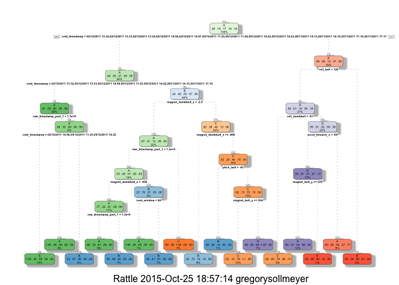
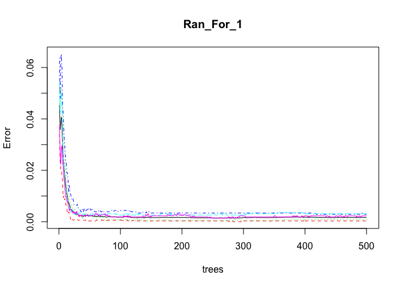
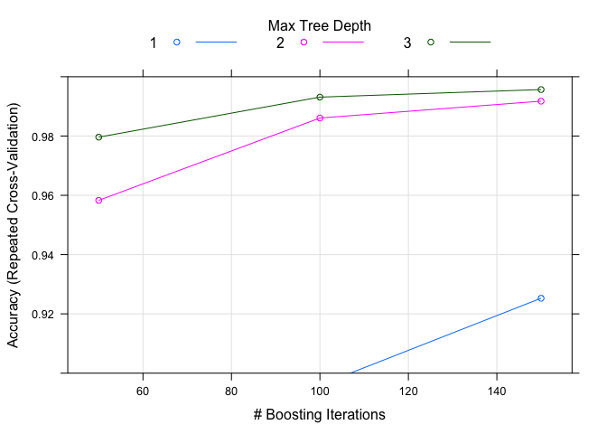

# Practical Machine Learning Project
G. S  
25 October 2015  

# PROJECT DESCRIPTION

## Background
Using devices such as Jawbone Up, Nike FuelBand, and Fitbit it is now possible to collect a large amount of data about personal activity relatively inexpensively. These type of devices are part of the quantified self movement – a group of enthusiasts who take measurements about themselves regularly to improve their health, to find patterns in their behavior, or because they are tech geeks. One thing that people regularly do is quantify how much of a particular activity they do, but they rarely quantify how well they do it. In this project, your goal will be to use data from accelerometers on the belt, forearm, arm, and dumbell of 6 participants. They were asked to perform barbell lifts correctly and incorrectly in 5 different ways. More information is available from the website here: http://groupware.les.inf.puc-rio.br/har (see the section on the Weight Lifting Exercise Dataset). 

## Data
The training data for this project are available here: 
https://d396qusza40orc.cloudfront.net/predmachlearn/pml-training.csv

The test data are available here: 
https://d396qusza40orc.cloudfront.net/predmachlearn/pml-testing.csv

The data for this project come from this source: 
http://groupware.les.inf.puc-rio.br/har. 
If you use the document you create for this class for any purpose please cite them as they have been very generous in allowing their data to be used for this kind of assignment.

## Project objective
The goal of your project is to predict the manner in which they did the exercise. This is the “classe” variable in the training set. You may use any of the other variables to predict with. You should create a report describing how you built your model, how you used cross validation, what you think the expected out of sample error is, and why you made the choices you did. You will also use your prediction model to predict 20 different test cases.

# Libraries

```r
library(caret)
```

```
## Warning: package 'caret' was built under R version 3.1.3
```

```
## Loading required package: lattice
```

```
## Warning: package 'lattice' was built under R version 3.1.3
```

```
## Loading required package: ggplot2
```

```
## Warning: package 'ggplot2' was built under R version 3.1.3
```

```r
library(rpart)
library(rpart.plot)
library(RColorBrewer)
library(rattle)
```

```
## Rattle: A free graphical interface for data mining with R.
## Version 3.4.1 Copyright (c) 2006-2014 Togaware Pty Ltd.
## Type 'rattle()' to shake, rattle, and roll your data.
```

```r
library(randomForest)
```

```
## randomForest 4.6-10
## Type rfNews() to see new features/changes/bug fixes.
```

```r
library(knitr)
```

```
## Warning: package 'knitr' was built under R version 3.1.3
```

```r
library(e1071)
library(gbm)
```

```
## Warning: package 'gbm' was built under R version 3.1.3
```

```
## Loading required package: survival
## 
## Attaching package: 'survival'
## 
## The following object is masked from 'package:caret':
## 
##     cluster
## 
## Loading required package: splines
## Loading required package: parallel
## Loaded gbm 2.1.1
```

# Getting the data

```r
set.seed(100)

train_URL <- "http://d396qusza40orc.cloudfront.net/predmachlearn/pml-training.csv"
test_URL <- "http://d396qusza40orc.cloudfront.net/predmachlearn/pml-testing.csv"

Training <- read.csv(url(train_URL), na.strings = c("NA","#DIV/0!",""))
Testing <- read.csv(url(test_URL), na.strings = c("NA","#DIV/0!",""))

# Splitting the training set in 2
inTrain <- createDataPartition(Training$classe, p = 0.6, list = FALSE)
myTraining <- Training[inTrain, ]
myTesting <- Training[-inTrain, ]

# Dimensions of the 2 sets
dim(myTraining)
```

```
## [1] 11776   160
```

```r
dim(myTesting)
```

```
## [1] 7846  160
```

# Cleaning the data
## Removing NearZeroVariance variables

```r
NZV <- nearZeroVar(myTraining, saveMetrics = TRUE)
myTraining <- myTraining[,NZV$nzv == FALSE]

NZV <- nearZeroVar(myTesting,saveMetrics = TRUE)
myTesting <- myTesting[,NZV$nzv == FALSE]

# Removing the first column of the myTraining data set
myTraining <- myTraining[c(-1)]

# Cleaning the variables with more than 60% N.A.
trainingV3 <- myTraining
for(i in 1:length(myTraining)) {
    if(sum(is.na(myTraining[, i]))/nrow(myTraining) >= .7) {
        for(j in 1:length(trainingV3)) {
            if(length(grep(names(myTraining[i]), names(trainingV3)[j])) == 1)  {
                trainingV3 <- trainingV3[ , -j]
            }   
        } 
    }
}

# Re-applying the original name
myTraining <- trainingV3
rm(trainingV3)

# Transforming the data sets
T_Clean_1 <- colnames(myTraining)

# Removing the classe column
T_Clean_2 <- colnames(myTraining[, -58])

# Re-writing the myTesting variables with myTraining variables
myTesting <- myTesting[T_Clean_1]
testing <- Testing[T_Clean_2]

# Dimensions of the 2 sets
dim(myTesting)
```

```
## [1] 7846   58
```

```r
dim(testing)
```

```
## [1] 20 57
```

```r
# Coercing the data into the same type
for (i in 1:length(testing)) {
    for(j in 1:length(myTraining)) {
        if(length(grep(names(myTraining[i]), names(testing)[j])) == 1)  {
            class(testing[j]) <- class(myTraining[i])
        }      
    }      
}

# Seting the same class for the 2 sets
testing <- rbind(myTraining[2, -58], testing)
testing <- testing[-1, ]
```

# Decision trees model

```r
set.seed(100)
Dec_Tree_1 <- rpart(classe ~ ., data = myTraining, method = "class")
fancyRpartPlot(Dec_Tree_1)
```

 

```r
Pred_DT <- predict(Dec_Tree_1, myTesting, type = "class")
Dec_Tree_CM <- confusionMatrix(Pred_DT, myTesting$classe)
Dec_Tree_CM
```

```
## Confusion Matrix and Statistics
## 
##           Reference
## Prediction    A    B    C    D    E
##          A 2148   61    6    3    0
##          B   67 1306  130   63    0
##          C   17  144 1186  132   46
##          D    0    7   31  885   83
##          E    0    0   15  203 1313
## 
## Overall Statistics
##                                           
##                Accuracy : 0.8715          
##                  95% CI : (0.8639, 0.8789)
##     No Information Rate : 0.2845          
##     P-Value [Acc > NIR] : < 2.2e-16       
##                                           
##                   Kappa : 0.8374          
##  Mcnemar's Test P-Value : NA              
## 
## Statistics by Class:
## 
##                      Class: A Class: B Class: C Class: D Class: E
## Sensitivity            0.9624   0.8603   0.8670   0.6882   0.9105
## Specificity            0.9875   0.9589   0.9477   0.9816   0.9660
## Pos Pred Value         0.9684   0.8340   0.7777   0.8797   0.8576
## Neg Pred Value         0.9851   0.9662   0.9712   0.9414   0.9796
## Prevalence             0.2845   0.1935   0.1744   0.1639   0.1838
## Detection Rate         0.2738   0.1665   0.1512   0.1128   0.1673
## Detection Prevalence   0.2827   0.1996   0.1944   0.1282   0.1951
## Balanced Accuracy      0.9749   0.9096   0.9073   0.8349   0.9382
```

# Random forests model

```r
set.seed(100)
Ran_For_1 <- randomForest(classe ~ ., data = myTraining)
Pred_RF <- predict(Ran_For_1, myTesting, type = "class")
Ran_For_CM <- confusionMatrix(Pred_RF, myTesting$classe)
Ran_For_CM
```

```
## Confusion Matrix and Statistics
## 
##           Reference
## Prediction    A    B    C    D    E
##          A 2231    0    0    0    0
##          B    1 1518    0    0    0
##          C    0    0 1367    1    0
##          D    0    0    1 1285    4
##          E    0    0    0    0 1438
## 
## Overall Statistics
##                                           
##                Accuracy : 0.9991          
##                  95% CI : (0.9982, 0.9996)
##     No Information Rate : 0.2845          
##     P-Value [Acc > NIR] : < 2.2e-16       
##                                           
##                   Kappa : 0.9989          
##  Mcnemar's Test P-Value : NA              
## 
## Statistics by Class:
## 
##                      Class: A Class: B Class: C Class: D Class: E
## Sensitivity            0.9996   1.0000   0.9993   0.9992   0.9972
## Specificity            1.0000   0.9998   0.9998   0.9992   1.0000
## Pos Pred Value         1.0000   0.9993   0.9993   0.9961   1.0000
## Neg Pred Value         0.9998   1.0000   0.9998   0.9998   0.9994
## Prevalence             0.2845   0.1935   0.1744   0.1639   0.1838
## Detection Rate         0.2843   0.1935   0.1742   0.1638   0.1833
## Detection Prevalence   0.2843   0.1936   0.1744   0.1644   0.1833
## Balanced Accuracy      0.9998   0.9999   0.9996   0.9992   0.9986
```

```r
plot(Ran_For_1)
```

 

# Boosted regression model

```r
set.seed(100)
Fit_Control <- trainControl(method = "repeatedcv", number = 5, repeats = 1)

Boo_Reg_1 <- train(classe ~ ., data=myTraining, method = "gbm",
                   trControl = Fit_Control, verbose = FALSE)
```

```
## Loading required package: plyr
```

```
## Warning: package 'plyr' was built under R version 3.1.3
```

```r
Boo_Reg_Pred <- predict(Boo_Reg_1, newdata = myTesting)
Boo_Reg_Acc <- confusionMatrix(Boo_Reg_Pred, myTesting$classe)
Boo_Reg_Acc
```

```
## Confusion Matrix and Statistics
## 
##           Reference
## Prediction    A    B    C    D    E
##          A 2230    0    0    0    0
##          B    2 1517    1    0    0
##          C    0    1 1358    0    0
##          D    0    0    9 1285    6
##          E    0    0    0    1 1436
## 
## Overall Statistics
##                                           
##                Accuracy : 0.9975          
##                  95% CI : (0.9961, 0.9984)
##     No Information Rate : 0.2845          
##     P-Value [Acc > NIR] : < 2.2e-16       
##                                           
##                   Kappa : 0.9968          
##  Mcnemar's Test P-Value : NA              
## 
## Statistics by Class:
## 
##                      Class: A Class: B Class: C Class: D Class: E
## Sensitivity            0.9991   0.9993   0.9927   0.9992   0.9958
## Specificity            1.0000   0.9995   0.9998   0.9977   0.9998
## Pos Pred Value         1.0000   0.9980   0.9993   0.9885   0.9993
## Neg Pred Value         0.9996   0.9998   0.9985   0.9998   0.9991
## Prevalence             0.2845   0.1935   0.1744   0.1639   0.1838
## Detection Rate         0.2842   0.1933   0.1731   0.1638   0.1830
## Detection Prevalence   0.2842   0.1937   0.1732   0.1657   0.1832
## Balanced Accuracy      0.9996   0.9994   0.9963   0.9985   0.9978
```

```r
plot(Boo_Reg_1, ylim = c(0.9, 1))
```

 

#Predicting Results on the Test Data
Random Forests gave an Accuracy in the myTesting dataset of 99.89%, which was more accurate that what I got from the Decision Trees or GBM. The expected out-of-sample error is 100-99.89 = 0.11%.


```r
Pred_2 <- predict(Ran_For_1, testing, type = "class")
Pred_2
```

```
##  2  3 41  5  6  7  8  9 10 11 12 13 14 15 16 17 18 19 20 21 
##  B  A  B  A  A  E  D  B  A  A  B  C  B  A  E  E  A  B  B  B 
## Levels: A B C D E
```

```r
# Submisson text file
pml_write_files = function(x){
    n = length(x)
    for(i in 1:n){
        filename = paste0("problem_id_",i,".txt")
        write.table(x[i], 
                    file = filename, 
                    quote = FALSE, 
                    row.names = FALSE, 
                    col.names=FALSE)
    }
}
```
